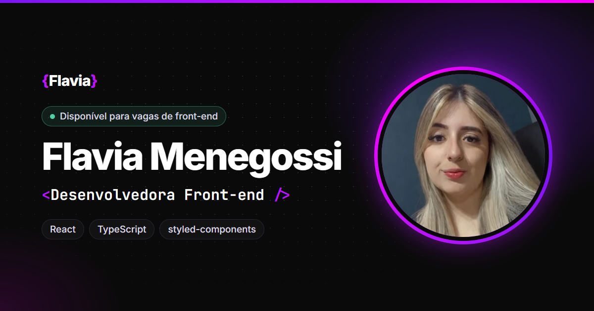

<h1 align="center">
  <span>{</span>Flavia<span>}</span> · Portfólio
</h1>

<p align="center">
  Portfólio de desenvolvedora front-end feito com React, TypeScript e styled-components.
</p>

<p align="center">
  
  
  
  
</p>

<p align="center">
  
</p>

## Sobre o projeto

Este é o meu portfólio pessoal: um site de página única que apresenta quem eu sou, as tecnologias que uso e os projetos que publiquei. A proposta visual segue um tema dev, com paleta neon roxa sobre fundo escuro.

O projeto começou em HTML, Sass e Gulp e foi migrado para **React com TypeScript**, trocando o Sass por **styled-components** e mantendo a mesma identidade visual.

## Funcionalidades

- **Cargo digitado como num terminal** no topo da página, alternando entre frases.
- **Busca rápida com <kbd>Ctrl</kbd> + <kbd>K</kbd>** (ou <kbd>⌘</kbd> + <kbd>K</kbd>), no estilo do VS Code, para ir a qualquer seção, abrir um projeto ou copiar o e-mail.
- **Menu que acompanha a rolagem**, marcando a seção visível, e barra de progresso de leitura.
- **Projetos com links para o site no ar e para o código** no GitHub.
- **Formulário de contato com validação** e estados de envio, sucesso e erro.
- **Animações que respeitam a preferência “reduzir movimento”** do sistema.
- **Pronto para compartilhar:** imagem de prévia, descrição e favicon para LinkedIn, WhatsApp e outras redes.

## Tecnologias

| Área | Ferramentas |
|---|---|
| Interface | React 19, TypeScript |
| Estilos | styled-components (tema, mixins e estilos globais) |
| Build | Vite |
| Ícones | react-icons (Phosphor e Simple Icons) |
| Fontes | Inter e JetBrains Mono, hospedadas no próprio projeto |

## Acessibilidade e performance

- Zero violações no [axe-core](https://github.com/dequelabs/axe-core) em desktop e celular.
- Contraste mínimo AA em todos os textos, foco visível no teclado e link “pular para o conteúdo”.
- Botões e links com área de toque de pelo menos 44 px.
- Imagens em WebP com dimensões declaradas e carregamento sob demanda.
- Sem Bootstrap e sem bibliotecas de CDN: o CSS final tem cerca de 7 KB.

## Como rodar

Pré-requisito: [Node.js](https://nodejs.org) 20 ou superior.

```bash
# instalar as dependências
npm install

# rodar em modo de desenvolvimento (abre em http://localhost:5173)
npm start

# gerar a versão de produção em dist/
npm run build

# visualizar a versão de produção
npm run preview
```

## Variáveis de ambiente

Crie um arquivo `.env` na raiz (ele não vai para o repositório):

```env
# Endereço público do site, sem barra no final.
# Necessário para a imagem de prévia aparecer ao compartilhar o link.
VITE_SITE_URL=https://seu-site.vercel.app

# ID de um formulário grátis do Formspree (https://formspree.io).
# Sem ele, o formulário abre o app de e-mail com a mensagem pronta.
VITE_FORMSPREE_ID=
```

Na Vercel, cadastre as mesmas variáveis em **Settings → Environment Variables**.

## Estrutura de pastas

```
src/
├── components/   cada componente em sua pasta, com index.tsx e styles.ts
├── data/         conteúdo do site: perfil, projetos, habilidades e links
├── hooks/        lógica reutilizável (rolagem, digitação, contadores)
├── styles/       tema, estilos globais, mixins e funções de cor
├── utils/        funções auxiliares
└── assets/       imagens do site
public/           favicon e imagem de prévia
```

Para atualizar textos, projetos ou habilidades, basta editar os arquivos em `src/data/`.

## Contato

- LinkedIn: [linkedin.com/in/flaviamenegossi](https://www.linkedin.com/in/flaviamenegossi/)
- GitHub: [github.com/FlaviaaMenegossi](https://github.com/FlaviaaMenegossi)
- E-mail: [flavinhamene12@gmail.com](mailto:flavinhamene12@gmail.com)
